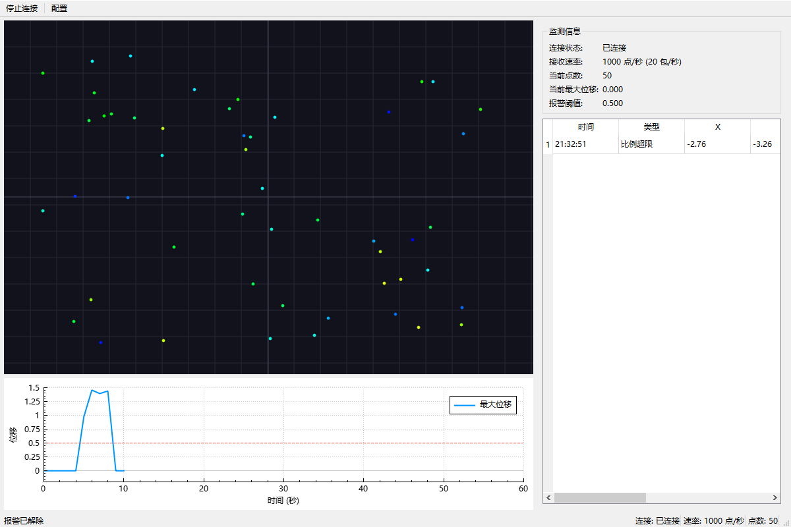

# 雷达点云监测系统

基于 **Qt6 + C++17** 的雷达点云监测上位机 Demo，用于模拟工业雷达监测场景。模拟雷达设备通过 TCP 持续发送点云数据，上位机接收、解析、实时显示，并对位移超阈值的数据触发预警，报警记录保存到 SQLite，重启后可查询历史。

## 功能简介

- 模拟雷达设备（TCP 服务端）持续发送点云数据
- 上位机（TCP 客户端）在子线程接收、解析并实时显示点云
- 对位移超阈值的数据触发预警（含去抖）
- 报警记录保存到 SQLite，重启后可查询历史

## 架构说明

```
Simulator(模拟设备) ──TCP──▶ DataReceiver(子线程接收/解析) ──跨线程信号──▶ 主线程
                                                                      ├─▶ PointCloudView 点云显示
                                                                      ├─▶ AlarmManager 预警判断 ──▶ DatabaseManager 存储 + 表格
                                                                      └─▶ TrendChart 实时曲线（每秒）
```

| 模块 | 职责 |
|------|------|
| `protocol` | 数据协议：包格式常量、序列化、解析（处理粘包/半包） |
| `simulator` | 模拟雷达设备：QTcpServer 监听 + QTimer 定时生成并发送点云 |
| `datareceiver` | 接收与解析：子线程读取、QByteArray 缓冲区、统计 |
| `pointcloudview` | 点云绘制：x/y 映射坐标，intensity 映射颜色，异常点红色 |
| `trendchart` | 实时曲线：封装 QCustomPlot，画最大位移 + 阈值线 |
| `alarmmanager` | 预警逻辑：基准值（前 100 帧）+ 位移阈值 + 比例去抖 |
| `databasemanager` | SQLite 存取：建表、插入报警、查询历史 |
| `mainwindow` | 组装所有模块：布局、信号槽、线程管理 |

### 数据协议（小端序）

```
偏移  长度   字段
0     2      magic       固定 0xAA55
2     1      version     固定 1
3     2      pointCount  本包点数
5     4      payloadLength 数据区字节数
9     N*24   数据区（每点：float32 x/y/z/intensity + double timestamp）
```

## 编译方法

### 方式一：Qt Creator

1. 用 Qt Creator 打开项目根目录的 `CMakeLists.txt`；
2. 选择 MinGW 64-bit 的 Kit（Qt 6.5+）；
3. 点击运行按钮编译并启动。

### 方式二：命令行 CMake

```bash
# 配置（以本机 Qt 安装路径为例）
cmake -S . -B build -G Ninja \
  -DCMAKE_PREFIX_PATH=<Qt安装路径>/6.x.x/mingw_64

# 编译
cmake --build build
```

运行前需确保 `Qt6Core.dll`、`Qt6Widgets.dll`、`Qt6Network.dll`、`Qt6Sql.dll` 等运行时库在 PATH 中（或用 windeployqt 部署）。

## 使用步骤

1. 启动程序，出现主窗口；
2. 点击工具栏 **「开始连接」**；
3. 观察左侧点云实时刷新、下方曲线实时绘制、右侧监测信息更新；
4. 模拟设备每 10 秒一个周期：前 5 秒正常，后 5 秒出现异常（部分点 z 位移超阈值）；
5. 异常触发报警后，右侧表格出现报警记录，同时写入 `radar_monitor.db`；
6. 点击 **「配置」** 可修改设备 IP、端口、位移阈值；
7. 关闭程序后重新打开，历史报警记录会自动加载到表格。

> 说明：报警判断需先收集前 100 帧建立基准值（约 5 秒），之后才进入报警判定。

## 演示截图



## 技术栈

- Qt 6.5+（MinGW 64-bit）
- C++17
- Qt Widgets / Qt Network / Qt Sql（SQLite）
- QCustomPlot（实时曲线，位于 `third_party/`）
